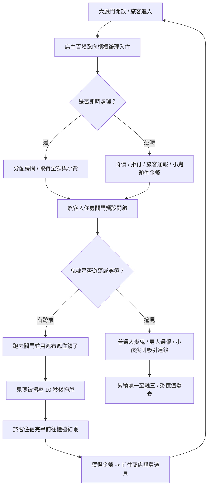

# 遊戲企劃書：《雪山深夜旅館的秘密》 (The Secret of the Mountain Hotel)

這是為 NYCU Game Jam 撰寫的遊戲企劃書 (GDD)。本次 Jam 的主題是 **門 (Door)**。

---

## 00 設計哲學 (Design Philosophy)

*   **核心問題**：玩家應該感受到什麼？
    *   **情緒目標**：**掌控與恐慌的博弈**。
    *   **情緒線索**：手忙腳亂的走位、監視與躲藏的張力、復古終端機的孤立感。
    *   **設計意圖**：玩家並非全知全能的滑鼠點擊者。你是在監視器螢幕內的一個「實體旅館老闆」，必須親自在門與門之間奔跑。綠色終端美學與實體開關門機制的結合，創造出一種幽閉恐懼且高度緊張的氛圍。

---

## 01 電梯簡報 (Elevator Pitch)

這是一款 2D 俯視視角的經營與靈異管理遊戲。玩家在**復古的綠色 CRT 監視終端界面**中，控制一個**必須親自跑去開關與鎖門的旅館老闆**，在**多種鎖鑰門機制、緩慢傳送的鏡子通道、以及具有不同視野與行為的旅客**限制下，一邊經營旅館辦理入住與結帳，一邊利用門鎖與道具遮布**隱瞞女兒的鬼魂存在，防止旅館陷入徹底的靈異混亂**。

---

## 02 核心玩法 (Core Gameplay)

玩家在 80% 的遊戲時間內會重複以下動作：
1.  **實體走位與櫃檯接待**：在顧客進入大門後，實體移動至**「櫃檯」**處理入住。若服務即時可獲得小費，逾時則會面臨拒付、扣款甚至通報警示的懲罰。
2.  **客房分配與管理**：分配顧客進入客房，並引導他們進行正常的入住與結帳流程。
3.  **走位與門鎖互動**：操控老闆奔跑，靠近門按鍵以進行手動鎖定、解鎖、開啟或關閉，阻隔鬼魂與住戶。
4.  **遮布與鏡子防禦**：當鬼魂試圖通過鏡子穿牆時，必須立刻跑去該房間使用**「遮布」**遮住鏡子。
5.  **商店購買道具**：利用賺取的金幣，在關卡間或開發者介面中購買眼罩、穿牆術、門鎖與口哨等防禦道具。

---

## 03 核心循環 (Core Loop)

**簡化公式**：
`[櫃檯辦理入住]` -> `[客房分配與管理]` -> `[門控與遮布阻擋鬼魂]` -> `[結帳取得金幣]` -> `[商店購買道具]`

---

## 04 遊戲賣點 (Hook)

*   **復古綠色終端機美學 (CRT Scanline Style)**：獨特的單色調綠色磷光螢幕特效，帶有掃描線與鏡頭畸變，讓遊戲本身就像是一個古老的主機終端。
*   **櫃檯經營與鬼魂躲避的雙重壓力**：你不能只專注於關門防鬼，因為你必須按時去櫃檯接待客人賺錢，而這迫使你必須離開安全的監控區域。
*   **客戶的動態視野與行為特徵**：每位客戶有其獨特的視野範圍（照亮黑暗迷宮）與隨機行為，使每次開局的旅館防線完全不同。

---

## 05 控制操作 (Controls)

*   **平台**：PC (網頁瀏覽器)
*   **控制方式**：
    *   `WASD` / `方向鍵`：控制旅館老闆移動。
    *   `Space` / `E`：與門、櫃檯或鏡子互動（必須站在旁邊）。
    *   `Shift`：奔跑（有體力限制，防止無限奔跑）。
    *   `Tab`：切換監控畫面的放大視野（如果需要微調）。
    *   `1` 至 `5`：使用或切換當前擁有的道具（遮布、眼罩、穿牆術、門鎖、口哨）。

---

## 06 關卡與晉級機制 (Levels & Progression)

### 15 個關卡與地圖解鎖 (1-4 地圖)
*   遊戲共設有 **15 個關卡**。
*   **每 5 個關卡** 會解鎖一名新的稽查員（Boss），代表一個大地圖的通關考驗。
*   擊倒一名稽查員後，即可解鎖下一張新的地圖。地圖難度隨之增加，房間結構更複雜，門的樣式也更豐富：
    *   **第 1-5 關 (地圖一 - 基礎旅館)**：基礎佈局，房間少，難度低。
    *   **第 6-10 關 (地圖二 - 雙層雪山別墅)**：引入羅生門與自動門，解鎖大膽男人與眼罩。
    *   **第 11-15 關 (地圖三 - 三層豪華酒店)**：高密度複雜門混雜，解鎖小鬼頭與高級 Boss。
    *   **第 4 張隱藏地圖 (終極無盡終端)**：開放全道具與所有門類型混雜挑戰。

### 金幣繼承與重測規則 (Gold Inheritance & Level Replay)
*   **金幣 (Gold)** 是遊戲中唯一的繼承資源，可用於在商店購買道具。
*   關卡是連續的，金幣會繼承。
*   **關卡重測覆寫**：玩家可以重複挑戰任何已通關的關卡。如果重複測試取得比原先「更高的金幣數」，該關卡的最高紀錄會自動覆寫。
*   這不會溯及既往地影響你在後面關卡已擁有的金幣量，但在**挑戰新的後續關卡時，你的初始金幣值會繼承先前關卡的最高金幣數紀錄**。這允許玩家不斷優化前期的結果，直到滿意再往下一關推進。

---

## 07 地圖規劃與核心區域 (Map Layout & Areas)

地圖的規劃包含以下四個不可或缺的區域：
1.  **櫃檯 (Reception Desk)**：辦理客人入住（Check-in）與結算金幣退房（Check-out）的地方。
2.  **交誼廳 (Social Lounge)**：部分的旅客會在此聚集、串門子或閒晃。
3.  **客房 (Rooms)**：顧客入住的區域。為了維持管理平衡，地圖中的**顧客總數必須在房間總數的 ½ 以下**。超過此數量則為極高難度或不可能通關。
4.  **走廊 (Corridors)**：連接客房、交誼廳與櫃檯的必要通道，也是鬼魂與玩家奔跑的主要路徑。

### 櫃檯前門與接待量要求
*   櫃檯前方的大門可由玩家主動開啟或關閉。
*   **關門時**，不會再有新的顧客進入旅館，適合用來暫時止血、整理館內局勢或集中處理鬼魂風險。
*   但每一關仍有**美觀/營運評價要求**，例如最低接待人數或最低完成入住數。若為了保守操作而長時間關門，可能導致該關卡即使存活也無法達成高評價或高金幣結算。
*   因此「是否暫停來客」本身也是策略抉擇：短期降低混亂，長期則可能犧牲收入與評分。

---

## 08 門的樣式與鎖鑰機制 (Door Styles & Unlock Schedule)

遊戲中共有 5 種特殊門樣式，隨關卡進度解鎖：

1.  **基礎門 (Standard Door) [Lv 1 解鎖]**：
    *   最穩定的防線。玩家手動開關或上鎖，除非被鬼魂強行撐開，否則狀態不會輕易變動。
2.  **羅生門 (Rashomon Door) [Lv 4 解鎖]**：
    *   隨著時間週期性地自動改變狀態（開啟/關閉）。
3.  **自動門 (Automatic Door) [Lv 7 解鎖]**：
    *   感應門。除非玩家使用「門鎖道具」將其鎖起，否則任何人類或鬼魂靠近時都會自動打開。
4.  **旋轉門 (Revolving Door) [Lv 10 解鎖]**：
    *   每次玩家或角色觸發時，門不是簡單的開/關，而是旋轉一個角度，**永遠會有一扇門板是關閉的**，考驗走位時機。
5.  **連鎖門 (Chain Door) [Lv 13 解鎖]**：
    *   成組出現。相同顏色的連鎖門共享同一個打開或關閉狀態（關閉 A 門會連動關閉所有同色門，或關閉 A 門會強行開啟 B 門）。

### 高難度門型混搭規則
*   高難度關卡不會替換掉低等級門型，而是**包含該難度以下所有已解鎖的門**。
*   關卡越後期，高階門在地圖中的**參合度**越高，也就是同一張地圖內會同時出現更多種門，並提高高階門所占比例。
*   這代表玩家在 Lv 13 之後，可能需要在同一局內同時處理基礎門、羅生門、自動門、旋轉門與連鎖門的複合壓力。

### 門擠壓機制 (Door Squeeze Strategic Block)
*   當鬼魂被關在房間內，且鏡子同時被「遮布」封印時，鬼魂會無路可去而**持續擠壓門**。
*   鬼魂需要約 **10 秒鐘** 才能撐開並掙脫門。這 10 秒鐘可為玩家爭取大量管理其他事務的時間。
*   這使得「關門」與「遮布封鏡」的組合成為高價值的拖延戰術，而不只是單純的防守手段。

---

## 09 顧客行為、視野與反應類別 (Customer Behavior, Vision & Scare States)

### 櫃檯接待與超時懲罰 (Counter Service Logic)
旅客在大門進入後會呼叫想要入住的客房號碼。玩家必須立即前往櫃檯處理：
*   **即時辦理**：可獲得房租與額外小費。
*   **逾時未處理 (Timeout Penalty)**：
    *   *膽小女人*：有 50% 機率直接生氣離開；50% 機率強行入住但只付一半的金幣。
    *   *大膽男人*：有 50% 機率強行入住但只付一半金幣；50% 機率直接前往外面通報，提早招來稽查員。
    *   *小鬼頭*：不會付任何錢，若逾時未接待，還會偷走你現有的金幣。
*   **入住規則**：玩家在櫃檯互動後可手動指定客人房間；若逾時，系統會隨機強行指定。客人入住後房門默認不關閉。

### 入住互動與房間指定流程
*   在按下一次與櫃檯的互動鍵後，玩家仍可在短時間內選擇該顧客的入住客房。
*   若顧客已逾時，則會被系統直接指定房間，降低玩家的調度空間。
*   顧客在入住期間會停留在房間內活動，且**預設不會主動把門關上**，因此房門狀態必須由玩家管理。
*   即使顧客待在房內，鬼魂仍可透過鏡子穿透，因此「已分房」不代表房間安全。

### 房間中有鬼時的處理規則
*   若鬼魂有從另一個房間穿透而來的跡象，玩家應立即使用遮布封住鏡子，並配合開門或關門改變鬼魂的可行路徑，將其導向其他房間或走廊。
*   若顧客準備入住的房間內已有鬼魂，玩家必須在辦理前先處理風險：
    *   可以先**關上門**，讓鬼魂改以鏡子穿透離開。
    *   也可以先**打開門並主動驅趕鬼魂**，清出安全空間後再安排入住。
*   因此在本作中，**開門與關門同樣重要**。關門不是唯一答案，開門也可能是調度鬼魂路徑的必要手段。

### 顧客三大類別行為與視野
旅館的防區通常是黑暗的，只有顧客的視野 cone 能夠照亮地圖。

| 顧客類型 | 視野特徵 (FOV) | 行為模式 (Behavior) | 撞鬼反應 (Scare Reaction) |
| :--- | :---: | :--- | :--- |
| **膽小女人 (Timorous Woman)** | **細長型** (狹窄但長) | 總是躲在房間內，偶爾會走到走廊與大廳行動。 | 立即嚇壞轉化為**短暫滯留的鬼魂**，隨後試圖逃出旅館外。若成功逃離，會計入一次**「醜一」**。 |
| **大膽男人 (Brave Man)** | **廣短型** (寬廣但短) | 偶爾待在房間，更常出現在走廊與交誼廳，偶爾會去別人房間串門子。 | 不會變鬼，但會立刻離開櫃檯跑向大門進行**通報**，直接累積一次**「醜一」**並使 Inspector 加速抵達。 |
| **小鬼頭 (Kid)** | **居中型** (中等寬度與長度) | 到處串門子，不安分待在同一個地方，但入住時間極短。 | 不受鬼魂影響，但會**大聲尖叫呼救**吸引周圍其他顧客前來，極易造成連鎖恐慌。 |

### 顧客解鎖節奏與樓層難度
*   三種顧客不會一開始全部出現，而是隨著主線進度逐步解鎖。
*   **第一層樓關卡**主要以基礎顧客與單純路徑教學為主。
*   **第二層樓關卡**開始加入更複雜的移動路徑、更多串門與更大的視野覆蓋壓力。
*   **第三層樓關卡**則導入最高密度的顧客干擾、更多房間與更複雜的門型混搭，形成完整壓力測試。
*   樓層提升不只是地圖變大，也代表顧客種類、房間結構與門控機制一起升級。

### 醜三判定 (Strike-Three Defeat)
*   不論是「膽小女人變鬼逃出旅館」或「大膽男人成功通報」，都會累積「醜一」。
*   **累積達到「醜三」 (Three Strikes) 則遊戲直接判定失敗**。

---

## 10 道具系統 (Items & Shop)

玩家可以在關卡結算後利用金幣在商店購買防禦道具：

1.  **遮布 (Cover Cloth)**：
    *   覆蓋鏡子，使鬼魂**永久無法藉由此鏡子穿透牆壁**。數量有限，玩家可以隨時「拿起搬走」遷移至其他房間。
2.  **眼罩 (Blindfold)**：
    *   給顧客戴上，使其暫時失去視野與行動能力。此狀態下為無敵狀態，且**不計入入住住宿時間**。
3.  **穿牆術/勞術 (Phase Shift)**：
    *   允許玩家短距離穿透一面牆壁，用於快速抄捷徑支援門鎖。
4.  **門鎖 (Door Lock)**：
    *   能強行將任意門鎖定一段時間，即使是自動門也可以被強行封死。
5.  **口哨 (Whistle)**：
    *   吹響口哨吸引鬼魂靠近。具備一定的穿牆範圍，鬼魂會暫時以最短路線向吹口哨的店主靠近。

---

## 11 美術與音效資源 (Assets)

### 音效分類資料夾與觸發規則 (`音效資產/`)

#### 1. `01_門與鎖頭` (Doors & Locks)
*   `關門聲.wav`：當玩家靠近門並按下 `E` 關閉門時播放。
*   `鎖門聲.wav`：當玩家靠近關閉的門按下 `E` 鎖上門時播放。
*   `解鎖門聲.wav`：當玩家靠近鎖定的門按下 `E` 解鎖時播放。
*   `無法開門聲.wav`：玩家試圖操作無權限的門（如自動門、靜止門）或門在冷卻中時播放。

#### 2. `02_靈異與鬼魂` (Ghosts & Apparitions)
*   `鬼呼聲.wav`：女兒鬼魂在隨機遊蕩漂浮時，隨機間隔播放。
*   `穿透牆壁聲.wav`：女兒鬼魂開始進行鏡子傳送引導時播放。
*   `傳送成功聲.wav`：女兒鬼魂瞬間移動穿牆到另一面鏡子的瞬間播放。
*   `變鬼聲.mp3`：普通旅客受驚轉化為鬼魂的瞬間播放。

#### 3. `03_旅客與稽查員` (Guests & Inspector)
*   `膽小女人尖叫.wav`：膽小女人撞見女兒或場上其他鬼魂時播放。
*   `大膽男人驚呼.wav`：大膽男人撞見鬼魂並準備通報時播放。
*   `稽查破門聲.wav`：大膽旅客通報成功或時間快結束，稽查員破門進入旅館時播放。
*   `稽查衝刺聲.wav`：稽查員小 Boss 在房間之間進行快速衝刺 (Dash) 時播放。
*   `心跳聲.mp3`：當旅館恐慌值 (Panic Meter) 超過 70% 時，高頻率心跳音循環播放。

#### 4. `04_系統與介面` (System & UI)
*   `主機開啟聲.wav`：開啟「隱藏開發者偵錯主機」時播放。
*   `按鍵盤聲.wav`：選單點擊、或系統日誌有新訊息印出時播放。
*   `錯誤提示音.wav`：畫面發生 Glitch 故障、或電力低於 30% 時播放。
*   `勝利凱旋聲.wav`：撐到 06:00 黎明勝利結算時播放。
*   `失敗陰鬱聲.wav`：遊戲失敗（如醜三或恐慌爆表）時播放。

---

## 12 最終驗收清單 (Final Checklist)

*   [ ] 玩家可以控制店主移動，實體跑去櫃檯辦理客人的 Check-in 與 Check-out 結帳。
*   [ ] 玩家可以控制櫃檯前大門開關，暫停新顧客進入，但仍需滿足關卡最低接待/評價要求。
*   [ ] 旅客具有視野區 (FOV)，可照亮部分黑暗旅館。
*   [ ] 女兒鬼魂隨機遊蕩；旅客會根據三種類型（膽小女人、大膽男人、小鬼頭）做出對應行為。
*   [ ] 櫃檯接待服務逾時有扣款、拒付、小鬼頭偷錢或大膽男人通報的懲罰。
*   [ ] 玩家可在櫃檯互動後手動指定房間，逾時則由系統直接指定；入住後房門預設為開啟。
*   [ ] 若房間內已有鬼，玩家必須透過開門、關門、遮布與鏡子路徑調度後，才能安全安排入住。
*   [ ] 旅客看到鬼魂會產生對應反應（女人變鬼逃出、男人通報累積醜一、小鬼尖叫）。
*   [ ] 大膽男人通報或女人變鬼逃離會累積「醜一」，累積「醜三」則遊戲失敗。
*   [ ] 門有 5 種樣式，並隨著關卡級別解鎖與混合。
*   [ ] 高難度關卡會同時包含所有已解鎖的低階門型，且高階門型參合度更高。
*   [ ] 當門關緊且鏡子被遮布蓋住時，鬼魂會被擠壓 10 秒後才能掙脫門。
*   [ ] 金幣可繼承，並支持重複挑戰已通關關卡覆寫最高金幣的機制。
*   [ ] 5 種道具（遮布、眼罩、穿牆術、門鎖、口哨）有對應的效果。
*   [ ] 顧客與樓層進度會逐步解鎖，第三層樓具有最高密度的房間、門型與行為干擾。
*   [ ] 音效在正確的時機（開關門、撞鬼、破門、鍵盤輸入、勝利/失敗）播放。
