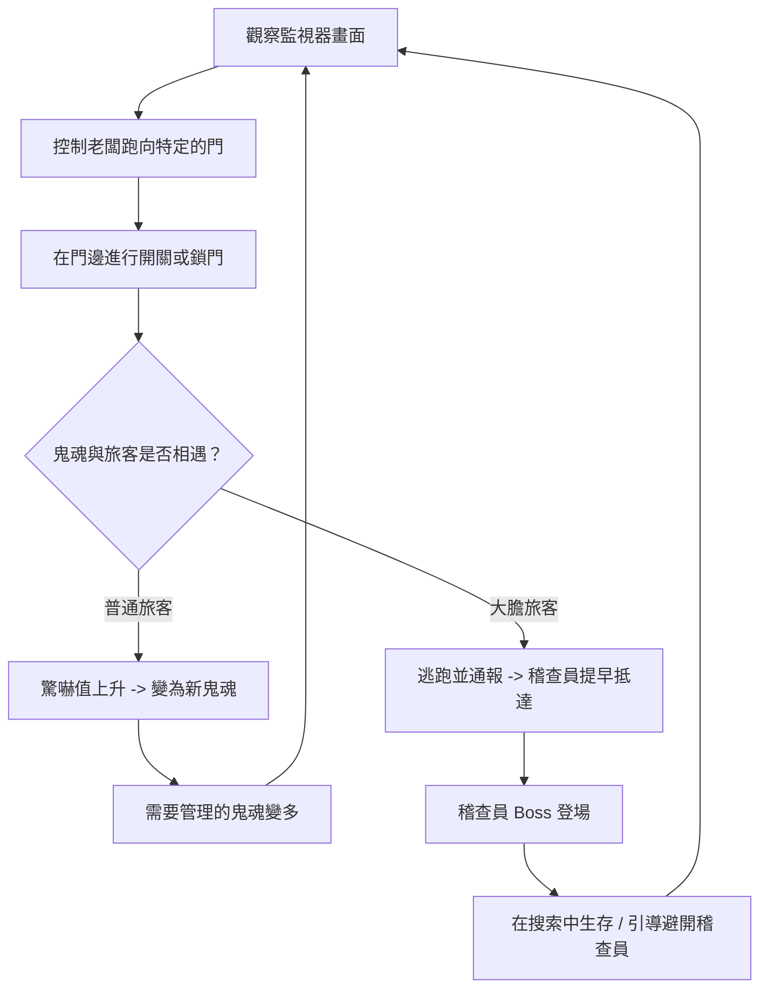

# 遊戲企劃書：《雪山深夜旅館的秘密》 (The Secret of the Mountain Hotel)

這是為 NYCU Game Jam 撰寫的遊戲企劃書 (GDD)。本次 Jam 的主題是 **門 (Door)**。

---

## 00 設計哲學 (Design Philosophy)

*   **核心問題**：玩家應該感受到什麼？
    *   **情緒目標**：**掌控與恐慌的博弈**。
    *   **情緒線索**：手忙腳亂的走位、監視與躲藏的張力、復古終端機的孤立感。
    *   **設計意圖**：玩家並非全知全能的滑鼠點擊者。你是在監視器螢幕內的一個「實體旅館老闆」，必須氣喘吁吁地在門與門之間奔跑。綠色終端美學與實體開關門機制的結合，創造出一種幽閉恐懼且高度緊張的氛圍。

---

## 01 電梯簡報 (Elevator Pitch)

這是一款 2D 俯視視角遊戲。玩家在**復古的綠色 CRT 監視終端界面**中，控制一個**必須親自跑去開關與鎖門的旅館老闆**，在**多種門機制、緩慢傳送的鏡子通道、以及會通報稽查員的大膽旅客**限制下，設法**隱瞞女兒的鬼魂存在，並防止旅館陷入徹底的靈異混亂**。

---

## 02 核心玩法 (Core Gameplay)

玩家在 80% 的遊戲時間內會重複以下三種動作：
1.  **走位與門鎖互動**：操控老闆角色奔跑，靠近門按鍵以進行手動鎖定、解鎖、開啟或關閉。
2.  **監視與路徑預判**：在 CRT 監視畫面中觀察旅客和鬼魂的走動方向，預判他們何時會相遇。
3.  **威脅管理與阻斷**：在膽小旅客被嚇到變鬼前隔離他們；在大膽旅客逃出旅館通報前阻截他們；並在高速移動的稽查員搜索期間進行迂迴躲藏。

---

## 03 核心循環 (Core Loop)



**簡化公式**：
`[觀察路徑]` -> `[跑去鎖門/開門]` -> `[重新引導鬼魂/旅客]` -> `[度過夜晚/躲過稽查員搜索]`

---

## 04 遊戲賣點 (Hook)

*   **復古綠色終端機美學 (CRT Scanline Style)**：獨特的單色調綠色磷光螢幕特效，帶有掃描線與鏡頭畸變，讓遊戲本身就像是一個古老的主機終端。
*   **實體開關門機制**：玩家不能隔空點擊。你必須親自跑到門邊互動，這會帶來極具張力的抉擇：「我是要先把旅客關在房間裡，還是先跑去鎖地下室的門？」
*   **連鎖混亂效應**：旅客受驚會變成新的鬼魂，鬼魂會透過鏡子（雖然很慢）穿牆。大膽的旅客會招來移動速度極快且會衝刺的稽查員，考驗玩家的極限反應。

---

## 05 控制操作 (Controls)

*   **平台**：PC (網頁瀏覽器)
*   **控制方式**：
    *   `WASD` / `方向鍵`：控制旅館老闆移動。
    *   `Space` / `E`：與門互動（必須站在門旁邊）。
    *   `Shift`：奔跑（有體力限制，防止無限奔跑）。
    *   `Tab`：切換監控畫面的放大視野（如果需要微調）。

---

## 06 勝負條件 (Victory and Defeat)

*   **勝利條件**：
    *   順利度過夜晚（例如現實時間 6 分鐘，代表遊戲中的晚上 10 點到早上 6 點）。
    *   稽查員前來完成搜索後離開，且期間未發現女兒鬼魂。
*   **失敗條件**：
    *   **恐慌值爆表**：太多旅客轉化為鬼魂，導致旅館恐慌值 (Panic Meter) 達到 100%。
    *   **被抓包**：稽查員直接撞見女兒鬼魂，或者偵測到過多的靈異現象。

---

## 07 最小可行性產品 (MVP)

*   **核心機制**：
    *   一個可移動的玩家角色。
    *   關閉時能阻擋路徑的普通門。
    *   女兒鬼魂（簡單的隨機遊蕩 AI）與 1 位普通旅客（簡單遊蕩 AI）。
    *   旅客看到鬼魂會產生驚嚇值，驚嚇值滿了會變鬼。
    *   全畫面的綠色 CRT 掃描線濾鏡。
*   **關卡場景**：一個包含 4 個房間的簡單旅館（大廳、客房 A、客房 B、走廊）。

---

## 08 地圖與環境機制 (Map & Environmental Mechanics)

### 門的種類 (Door Types)
1.  **基本門 (Standard Door)**：玩家手動開關與上鎖。是最穩定、可控的防線。
2.  **自動門 (Automatic Door)**：每隔固定秒數（如 5 秒）會自動開閉，無法永久鎖上，考驗通過的時間差。
3.  **雙向連動門 (Link-Controlled Door)**：成對出現。當關閉 A 門時，B 門會連動開啟，反之亦然。需要玩家在腦中規劃互補的行走路線。
4.  **不可控/靜止門 (Static Door)**：玩家無法互動，可能只對特定人物（例如鬼魂或特定員工）開放。

### 鏡子傳送門 (Mirror Portals)
*   部分房間內設有鏡子，鬼魂可以藉由鏡子穿牆傳送。
*   **平衡設計**：鬼魂傳送時會有非常長的「引導時間（Channeling Time）」，此時鏡子會發光或震動，給予玩家充足的反應時間跑去另一端圍堵。

---

## 09 角色與 AI 類別 (Character & AI Classes)

1.  **普通住戶 (Basic Guest)**：
    *   見到鬼魂會受到極度驚嚇。驚嚇值累積滿後會轉化為「新的鬼魂」，使地圖上的靈異干擾變多。
2.  **大膽住戶 (Brave Guest)**：
    *   膽子極大，看到鬼魂不會變鬼，而是會立刻往旅館大門奔跑並逃出通報。成功逃脫會使「稽查員（小Boss）」提前抵達。
3.  **稽查員 (Inspector - Mini Boss)**：
    *   在特定時間或被旅客通報時出現。
    *   移動速度快，擁有「多重位移/衝刺技能 (Dashing/Displacement)」，會快速在房間之間巡邏。
    *   玩家無法用常規手段阻擋他，只能依靠時間差與複雜的連動門將其引導避開女兒鬼魂。

---

## 10 美術與音效資源 (Assets)

*   **視覺風格**：2D 俯視像素藝術，套用「復古綠色終端機 CRT 濾鏡」（單色綠色調、掃描線、微幅鏡頭畸變）。
*   **美術素材需求**：
    *   玩家（旅館老闆）：走路動畫。
    *   女兒鬼魂：半透明、飄浮的綠色像素精靈。
    *   普通/大膽旅客：行走與恐慌奔跑動畫。
    *   稽查員：獨特的 Boss 設計，帶有位移/衝刺的特效。
    *   門：開啟/關閉狀態（自動門需有閃爍指示燈，連動門需有連線標示）。
    *   鏡子：常態與傳送中（鏡子中出現詭異眼睛）的動畫。
*   **音效需求與觸發規則**：
    音效已分類整理於 `音效資產/` 的四個子資料夾中，具體編制與觸發時機規範如下：

    #### 1. `01_門與鎖頭` (Doors & Locks)
    *   `關門聲.wav`：當玩家靠近門並按下 `E` 關閉門時播放。
    *   `鎖門聲.wav`：當玩家靠近關閉的門按下 `E` 鎖上門時播放。
    *   `解鎖門聲.wav`：當玩家靠近鎖定的門按下 `E` 解鎖時播放。
    *   `無法開門聲.wav`：玩家試圖操作無權限的門（如自動門、靜止門）或門在冷卻中時播放。

    #### 2. `02_靈異與鬼魂` (Ghosts & Apparitions)
    *   `鬼呼聲.wav`：女兒鬼魂在房間或走廊隨機遊蕩漂浮時，每隔一段時間隨機播放，增添氣氛。
    *   `穿透牆壁聲.wav`：女兒鬼魂靠近鏡子傳送門，開始進行引導（Channeling）穿牆傳送時播放（循環或長音效）。
    *   `傳送成功聲.wav`：女兒鬼魂引導完畢，成功瞬間移動穿牆到另一面鏡子的瞬間播放。
    *   `變鬼聲.mp3`：普通旅客受驚度達到 100% 崩潰，轉化為遊蕩鬼魂的瞬間播放。

    #### 3. `03_旅客與稽查員` (Guests & Inspector)
    *   `膽小女人尖叫.wav`：普通旅客（Basic Guest）在視線範圍內撞見女兒鬼魂或場上任何鬼魂時播放。
    *   `大膽男人驚呼.wav`：大膽旅客（Brave Guest）在視線範圍內撞見鬼魂、並開始向出口奔跑通報時播放。
    *   `稽查破門聲.wav`：大膽旅客成功逃出通報，或是時間快結束，稽查員小 Boss 破門強行進入旅館的瞬間播放。
    *   `稽查衝刺聲.wav`：稽查員小 Boss 在房間之間進行快速位移/衝刺（Dashing）時播放。
    *   `心跳聲.mp3`：當旅館恐慌值（Panic Meter）超過 70% 時，心跳聲開始播放並以高頻率循環，給予玩家聽覺上的危機感。

    #### 4. `04_系統與介面` (System & UI)
    *   `主機開啟聲.wav`：當玩家點擊螢幕標題 5 下或按鍵盤 5 下開啟「隱藏開發者偵錯主機」時播放。
    *   `按鍵盤聲.wav`：在選單點擊按鈕、打字、或系統日誌有新訊息印出時播放。
    *   `錯誤提示音.wav`：遊戲發生系統故障（如畫面靜電噪聲 Glitch）、或電力即將耗盡時播放。
    *   `勝利凱旋聲.wav`：順利度過夜晚撐到 06:00 黎明，遊戲結算勝利時播放。
    *   `失敗陰鬱聲.wav`：因被稽查員發現或恐慌值達到 100% 導致遊戲失敗時播放。


---

## 11 AI 工具鏈 (AI Pipeline)

*   **圖像與著色器**：使用 AI 輔助生成 WebGL 的綠色 CRT 掃描線 shader 代碼。
*   **程式碼**：利用 AI 撰寫狀態機控制、尋路演算法（針對不同人物的開關門權限調整 A* 尋路）。

---

## 12 技術選型 (Tech)

*   **遊戲引擎**：HTML5 Canvas + 原始 JavaScript / TypeScript (或 Phaser 3 框架)。
*   **渲染**：WebGL（用於 CRT 螢幕著色器特效）或 Canvas 2D 疊加掃描線圖層。
*   **託管與發布**：GitHub Pages 或 Itch.io（便於點開即玩）。

---

## 13 時程表 (Timeline - 48小時)

*   **第 1 天 上午 (0-6h)**：建立專案架構、實作綠色 CRT 渲染濾鏡、玩家基礎移動。
*   **第 1 天 下午 (6-18h)**：實作基礎門開關、鬼魂與普通旅客的寻路 AI、視線碰撞與驚嚇偵測。
*   **第 2 天 上午 (18-30h)**：加入大膽旅客、擁有衝刺位移的稽查員 Boss、鏡子引導傳送機制。
*   **第 2 天 下午 (30-42h)**：實作特殊門類型（自動門、連動門）、勝負判定 UI、音效整合。
*   **提交前夕 (42-48h)**：平衡數值調整（角色速度、驚嚇累積速度）、打包測試、上傳至 Itch.io。

---

## 14 優先刪除列表 (Cut List)

如果時間不夠，我們將按以下順序刪除功能：
1.  **雙向連動門 (Link-Controlled Doors)**：退化為普通門。
2.  **大膽住戶 (Brave Guest)**：僅使用普通住戶，簡化 AI 狀態管理。
3.  **稽查員位移技能 (Inspector Dashing Skills)**：讓稽查員只以一般的高速度移動，取消瞬移/衝刺技能。
4.  **自動門 (Automatic Doors)**：全都改為普通門。

---

## 15 展示流程 (Demo Flow)

*   **0-10s**：螢幕閃爍亮起，顯示旅館的等寬字符監控畫面。玩家控制老闆角色走到櫃檯接待第一位普通旅客。
*   **10-30s**：女兒的鬼魂從臥室飄出。一名大膽旅客看見她，驚慌地往大門衝去準備通報。玩家迅速奔跑至大門前，在關鍵時刻關上大門將其鎖在室內。
*   **30-60s**：女兒朝著鏡子走去，鏡子開始閃爍（傳送中）。玩家預判她的傳送目的地，提前跑到該房間將自動門鎖上，而此時大門口傳來劇烈敲門聲——稽查員（小 Boss）強行進入，開始高速巡邏！

---

## 16 視覺風格與設計系統規格 (Visual Style & Design System)

本遊戲採用 **Terminal CLI (終端控制台)** 復古美學，結合綠色磷光 CRT 監視器風格，呈現出冷酷、網絡工業且孤立的雪山旅館氛圍。

### 🎨 顏色標記 (Design Tokens - Dark Mode Only)
高對比的單色調模擬舊型顯示器，非必要不引入其他色彩：
*   **背景 (Background)**: `#0a0a0a`（極深灰黑，非 OLED 純黑，以保留 CRT 掃描線與背景噪點）。
*   **主色調 (Primary)**: `#33ff00`（經典螢光綠，用於正常狀態的文字、地圖牆壁線條、普通門）。
*   **次要色調 (Secondary)**: `#ffb000`（琥珀橘，用於警告、旅客驚嚇度上升、大膽旅客通報狀態）。
*   **暗色邊框 (Muted/Border)**: `#1f521f`（暗綠色，用於未選中的選單、關閉的門、房間網格背景）。
*   **強調色 (Accent)**: `#33ff00`（用於閃爍的游標或玩家控制的角色標識）。
*   **錯誤/警報 (Error)**: `#ff3333`（警示紅色，用於稽查員出現、女兒被看見、或旅客崩潰變鬼的瞬間）。

### 📝 字體與排版 (Typography)
*   **字型**: 採用 `VT323` 或 `Fira Code` 等像素等寬字型，確保所有字元在網格上完美對齊。
*   **樣式**: 所有的標題與警告必須為 **全大寫 (ALL CAPS)**，普通系統日誌與控制台提示字可使用小寫。
*   **圓角**: `0px`。所有視窗、按鈕與指示器均為絕對直角，不使用任何圓角。

### 🖥️ 元件設計與 ASCII 元素 (Components & ASCII)
*   **按鈕 (Buttons)**: 使用括號包覆的文字，例如 `[ 鎖門 / LOCK ]` 或 `[ 開啟 / OPEN ]`。懸停時背景填滿螢光綠，文字反白。
*   **監視器面板 (CCTV Panes)**: 使用 ASCII 符號構成視窗邊界，例如：
    ```text
    +--- CAM-01: LOBBY ------------------+
    |                                    |
    |  P         [D]     G               |
    |                                    |
    +----------------------------- [OK] -+
    ```
*   **數據視覺化 (Data Visuals)**: 所有計量條與數值指示均使用 ASCII 進度條：
    *   旅客驚嚇值：`SCARE [██████░░░░] 60%`
    *   稽查員抵達倒數：`ALERT [||||||||...]`
*   **特效 (Visual Effects)**:
    *   **掃描線濾鏡 (CRT Overlay)**: 畫面鋪上一層微弱的橫向掃描線與鏡頭邊緣畸變效果。
    *   **打字機效果 (Typewriter)**: 系統日誌與警報警告文字逐字出現。
    *   **螢光殘影 (Phosphor Glow)**: 畫面的主要綠色文字與線條帶有淡淡的發光殘影 (`text-shadow`)。
    *   **雜訊閃爍 (Glitch Static)**: 當鬼魂經過鏡子或進行傳送時，該房間的監視器畫面會產生短暫的 ASCII 亂碼或畫面抖動。

---

## 17 網頁技術實作與拼接方案 (Web Technology Implementation & DOM Assembly Plan)

這款遊戲的技術本質不是傳統的複雜 3D 或重度物理引擎，而是一個**「會動的網頁控制面板與實體地圖」**。非常適合完全使用 **HTML + CSS + JavaScript** 進行拼接，在開發時間有限的 Game Jam 中這是最高效且合理的選擇。

### 1. 旅館迷宮本體（DOM 元素拼貼）
旅館的房間與走廊不需要手動繪製複雜的像素大圖，可以直接使用 CSS Grid/Flexbox 與絕對定位的 `div` 元素進行組合：
*   **房間結構**：
    ```html
    <div class="hotel-map">
      <div class="room room-101" data-label="客房 101"></div>
      <div class="corridor" id="main-hallway"></div>
      <!-- 門元件 -->
      <button class="door door-red" id="door-lobby" data-state="closed"></button>
    </div>
    ```
*   **CSS 樣式控制**：用 CSS 處理綠色電子牆壁、深色地板、房間邊框、發光門燈、CRT 掃描線、監控噪點與綠色 UI 面板。

### 2. 門鎖互動（HTML Button + CSS 狀態機）
因為「門」是核心玩法，將門設計為獨立的 DOM 按鈕元件，能最快實現互動與狀態同步：
*   **狀態更新**：利用 JS 的 Dataset 控制門的狀態 `door.dataset.state = "locked";`。
*   **視覺樣式**：
    ```css
    .door[data-state="open"] { opacity: 0.3; } /* 開門：半透明無阻擋 */
    .door[data-state="closed"] { opacity: 1; border-color: #33ff00; } /* 關門：綠色實線 */
    .door[data-state="locked"] { box-shadow: 0 0 10px #ff3333; border-color: #ff3333; } /* 上鎖：紅色警示發光 */
    ```

### 3. 監控 UI（純 CSS 特效）
*   **CRT 掃描線**：使用一個覆蓋全螢幕的 `::after` 虛擬元素，套用微幅透明的橫向條紋漸層，免去 WebGL 負擔。
*   **系統警告與驚嚇值條**：直接用 HTML5 `<progress>` 或 `div` 寬度配合 `text-shadow` 實現經典綠色磷光發光條。

---

## 18 遊戲美術素材製作指南 (AI Sprite sheet Production Guide)

我們將美術素材的開發分為三個層次，以確保在 48 小時內優先產出核心玩法：

### A. 必須生成/手動處理的少量素材（四方向基準）
為保留角色辨識度，採用 Notion 內的《AI 遊戲精靈圖工作流》，只製作 **東、西、南、北** 四個面向的單張基準圖，暫不製作走路動畫。

| 角色名稱 | 製作優先度 | 原因與實作細節 |
| :--- | :---: | :--- |
| **女兒鬼魂** | ★★★★★ | 核心關鍵。需呈半透明、綠色像素漂浮質感。 |
| **旅館主人** | ★★★★★ | 玩家操作角色，畫面視覺中心。 |
| **一般旅客** | ★★★★☆ | 1~2 種像素外觀即可，重複使用。 |
| **稽查員 (Boss)** | ★★★★☆ | 小 Boss，需有高辨識度的嚴肅套裝與墨鏡。 |
| **變鬼的旅客** | ★☆☆☆☆ | **無需重畫**：直接將一般旅客的精靈圖套用 CSS 濾鏡（如 `filter: drop-shadow() invert() hue-rotate()`）轉成幽靈色。 |

### B. 完全用 CSS 實現、不急著畫圖的項目
*   **地圖環境**：牆壁、走廊、房間格線、鏡子發光外框。
*   **互動指示**：開啟、關閉、鎖定、警報閃爍、進度條、冷卻計時器。

### C. 角色精靈圖標準化工作流 (Notion Workflow)
1.  **立繪設計 (Box Art)**：利用 AI 生成角色的基本像素設定。
2.  **朝南基準 (South Anchor)**：生成正面圖作為核心基準。
3.  **四方向投影 (Directional Anchors)**：以正面圖為基礎，推導出背面 (北)、側面 (東/西)。
4.  **標準化與去背 (Normalization) [手動重要步驟]**：
    *   使用 Aseprite 或 LibreSprite 去除背景，轉為 transparent PNG。
    *   將四向圖裁切並置中於 32x32 像素的網格內，確保角色中心點與腳底位置一致，避免在網格移動時產生抖動。

---

## 19 遊戲開發兩階段實作策略 (MVP Development Strategy)

### 【第一階段：符號拼貼測試版】
完全不使用任何美術精靈圖，直接用 ASCII 符號代替地圖角色，優先驗證核心機制：
*   店主：`■`（綠色方塊）
*   女兒鬼魂：`◇`（青色菱形）
*   旅客：`●`（琥珀色圓形）
*   稽查員：`▲`（紅色三角）
*   門：彩色線條 / 鏡子：亮色矩形
*   **目標**：確保 NPC 尋路、視野檢測（視線射線撞擊）、門阻擋邏輯、驚嚇值累積與稽查員計時器在無圖狀態下能完美運行。

### 【第二階段：素材替換與風格化】
當核心循環好玩且無 Bug 後，將 ASCII 符號替換為「C. 標準化工作流」所產生的四方向角色 PNG。接著套用 CRT 掃描線 shader/濾鏡，並加入音效。

---

## 20 技術難度評估與工期分配 (Technical Difficulty Estimates)

*   **旅館地圖 DOM 拼接與渲染**：低難度 (4 小時)
*   **實體開關門與鎖門機制**：低難度 (3 小時)
*   **全螢幕 CRT 掃描線與故障特效 (CSS/JS)**：中難度 (4 小時)
*   **NPC (鬼魂、旅客) 房間隨機尋路**：中難度 (8 小時)
*   **視線偵測 (視野扇形射線碰撞檢測)**：中難度 (8 小時)
*   **鏡子引導傳送機制**：中難度 (4 小時)
*   **稽查員 Boss 衝刺與快速巡邏 AI**：中高難度 (8 小時)
*   **數值微調與音效整合**：低難度 (5 小時)

---

## 21 最終驗收清單 (Final Checklist)

*   [ ] 玩家可以控制老闆角色移動並靠近門按鍵進行鎖定/解鎖。
*   [ ] 女兒鬼魂會隨機遊蕩；旅客會在地圖中移動。
*   [ ] 旅客看到鬼魂時驚嚇值會上升，滿值時會變為新鬼魂。
*   [ ] 大膽旅客被嚇到後會試圖逃到出口，成功逃脫會使稽查員提早抵達。
*   [ ] 稽查員（小 Boss）擁有高移動力及衝刺技能，會主動巡視旅館。
*   [ ] 鏡子會作為鬼魂的傳送門，傳送時有長達數秒的引導動畫。
*   [ ] 全畫面覆蓋綠色 CRT 掃描線濾鏡與等寬字元介面。
*   [ ] 具備清晰的勝負判定（時間結束且未被發現 vs. 驚嚇度破表或被稽查員抓到）。
*   [ ] 遊戲能成功打包並在瀏覽器流暢運行。
