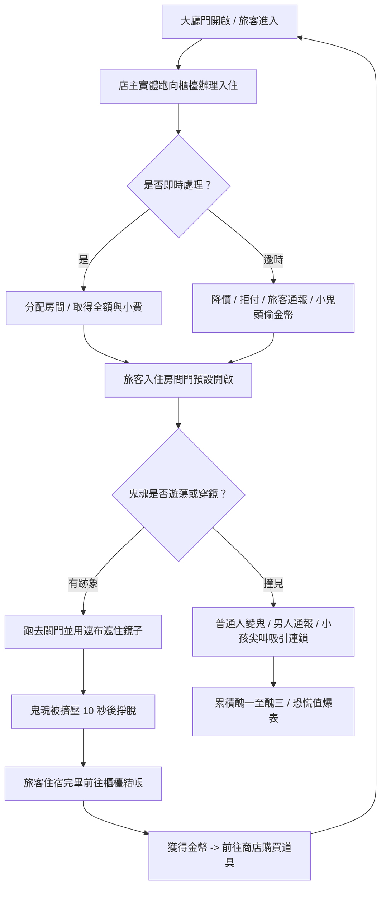

# 遊戲企劃書：《雪山深夜旅館的秘密》 (The Secret of the Mountain Hotel)

這是為 NYCU Game Jam 撰寫的遊戲企劃書 (GDD)。本次 Jam 的主題是 **門 (Door)**。

---

## 00 設計哲學 (Design Philosophy)

*   **核心問題**：玩家應該感受到什麼？
    *   **情緒目標**：**掌控與恐慌的博弈**。
    *   **情緒線索**：手忙腳亂的走位、監視與躲藏的張力、復古終端機的孤立感。
    *   **設計意圖**：玩家並非全知全能的滑鼠點擊者。你是在監視器螢幕內的一個「實體旅館老闆」，必須親自在門與門之間奔跑。綠色終端美學與實體開關門機制的結合，創造出一種幽閉恐懼且高度緊張的氛圍。

---

## 01 電梯簡報 (Elevator Pitch)

這是一款 2D 俯視視角的經營與靈異管理遊戲。玩家在**復古的綠色 CRT 監視終端界面**中，控制一個**必須親自跑去開關與鎖門的旅館老闆**，在**多種鎖鑰門機制、緩慢傳送的鏡子通道、以及具有不同視野與行為的旅客**限制下，一邊經營旅館辦理入住與結帳，一邊利用門鎖與道具遮布**隱瞞女兒的鬼魂存在，防止旅館陷入徹底的靈異混亂**。

---

## 02 核心玩法 (Core Gameplay)

玩家在 80% 的遊戲時間內會重複以下動作：
1.  **實體走位與櫃檯接待**：在顧客進入大門後，實體移動至**「櫃檯」**處理入住。若服務即時可獲得小費，逾時則會面臨拒付、扣款甚至通報警示的懲罰。
2.  **客房分配與管理**：分配顧客進入客房，並引導他們進行正常的入住與結帳流程。
3.  **走位與門鎖互動**：操控老闆奔跑，靠近門按鍵以進行手動鎖定、解鎖、開啟或關閉，阻隔鬼魂與住戶。
4.  **遮布與鏡子防禦**：當鬼魂試圖通過鏡子穿牆時，必須立刻跑去該房間使用**「遮布」**遮住鏡子。
5.  **商店購買道具**：利用賺取的金幣，在關卡間或開發者介面中購買眼罩、穿牆術、門鎖與口哨等防禦道具。

---

## 03 核心循環 (Core Loop)

**簡化公式**：
`[櫃檯辦理入住]` -> `[客房分配與管理]` -> `[門控與遮布阻擋鬼魂]` -> `[結帳取得金幣]` -> `[商店購買道具]`

---

## 04 遊戲賣點 (Hook)

*   **復古綠色終端機美學 (CRT Scanline Style)**：獨特的單色調綠色磷光螢幕特效，帶有掃描線與鏡頭畸變，讓遊戲本身就像是一個古老的主機終端。
*   **櫃檯經營與鬼魂躲避的雙重壓力**：你不能只專注於關門防鬼，因為你必須按時去櫃檯接待客人賺錢，而這迫使你必須離開安全的監控區域。
*   **客戶的動態視野與行為特徵**：每位客戶有其獨特的視野範圍（照亮黑暗迷宮）與隨機行為，使每次開局的旅館防線完全不同。

---

## 05 控制操作 (Controls)

*   **平台**：PC (網頁瀏覽器)
*   **控制方式**：
    *   `WASD` / `方向鍵`：控制旅館老闆移動。
    *   `Space` / `E`：與門、櫃檯或鏡子互動（必須站在旁邊）。
    *   `Shift`：奔跑（有體力限制，防止無限奔跑）。
    *   `Tab`：切換監控畫面的放大視野（如果需要微調）。
    *   `1` 至 `5`：使用或切換當前擁有的道具（遮布、眼罩、穿牆術、門鎖、口哨）。

---

## 06 關卡與晉級機制 (Levels & Progression)

### 15 個關卡與地圖解鎖 (1-4 地圖)
*   遊戲共設有 **15 個關卡**。
*   **每 5 個關卡** 會解鎖一名新的稽查員（Boss），代表一個大地圖的通關考驗。
*   成功讓一名稽查員在當晚稽查中**無功而返**後，即可解鎖下一張新的地圖。地圖難度隨之增加，房間結構更複雜，門的樣式也更豐富：
    *   **第 1-5 關 (地圖一 - 基礎旅館)**：基礎佈局，房間少，難度低。
    *   **第 6-10 關 (地圖二 - 雙層雪山別墅)**：引入羅生門與自動門，解鎖大膽男人與眼罩。
    *   **第 11-15 關 (地圖三 - 三層豪華酒店)**：高密度複雜門混雜，解鎖小鬼頭與高級 Boss。
    *   **第 4 張隱藏地圖 (終極無盡終端)**：開放全道具與所有門類型混雜挑戰。

### 過關與失敗條件
*   **過關＝達成金錢門檻（Quota）**。每一關設有一個**目標金額（moneyTarget）**，玩家只要在天亮（06:00）前，當晚**累計賺到的總金額**達到該門檻，即立即過關，不必硬撐到時間結束。
    *   評分指標是「**整晚累計賺到的總額（gross earned）**」，**不是**最後手上剩下或淨增加的金幣。也就是說，買道具花掉的錢不會倒扣這個過關進度。
    *   玩家在**進入關卡前**（選關畫面）就能看到該關所需的目標金額，方便規劃。
*   **失敗條件**（任一成立即敗）：
    *   **醜三提前出局**：醜值累積到「醜三」立即失敗，不必等時間結束。
        *   膽小女人撞鬼後變鬼並成功逃出旅館 → 累積一次醜一。
        *   大膽男人撞鬼後成功離開並完成通報 → 累積一次醜一。
        *   大膽男人因逾時接待而當場通報 → 累積一次醜一。
    *   **恐慌值爆表**：恐慌值達 100%。
    *   **女兒曝光**：稽查員對女兒鬼魂的懷疑值累積至臨界點。直接目擊會大幅提高懷疑值，但不會在第一次看見時立刻判定失敗，玩家仍保有極短暫的補救空間。
    *   **未達門檻**：天亮（06:00）時累計金額仍未達當關目標金額。
*   因此本作的核心目標可以簡化為：**在天亮前賺到足夠的錢達成門檻，同時避免醜三提前出局。**

> 詳細的房費、小費、逾時懲罰與各關門檻，見下方「金錢結算與每關門檻」。

### 金幣繼承與重測規則 (Gold Inheritance & Level Replay)
*   **金幣 (Gold)** 是遊戲中唯一的繼承資源，可用於在商店購買道具。
*   關卡是連續的，玩家通關時所持有的金幣會作為後續關卡的起始資本。
*   **關卡重測覆寫**：玩家可以重複挑戰任何已通關的關卡。如果重複測試取得比原先「更高的金幣數」，該關卡的最高金幣紀錄會自動覆寫。
*   **繼承判定方式**：當玩家挑戰尚未完成的新後續關卡時，系統會讀取前序關卡鏈中已保存的最佳金幣結果，作為該次挑戰的起始金幣。換句話說，玩家可以反覆優化前面關卡，等刷到最滿意的金幣結果後，再往下一關推進。
*   **不溯及既往**：這個覆寫不會回頭修改你先前已完成之後關卡的單次結算結果，但會影響你未來再次挑戰更後面關卡時所能繼承的起始金額。
*   設計目的在於讓「高品質經營」成為長期優勢。前期若能穩定控恐慌、減少醜值、提高退房收益，就能在後期以更高資本購買更多救場道具。

---

## 07 地圖規劃與核心區域 (Map Layout & Areas)

地圖的規劃包含以下四個不可或缺的區域：
1.  **櫃檯 (Reception Desk)**：辦理客人入住（Check-in）與結算金幣退房（Check-out）的地方。
2.  **交誼廳 (Social Lounge)**：部分的旅客會在此聚集、串門子或閒晃。
3.  **客房 (Rooms)**：顧客入住的區域。為了維持管理平衡，地圖中的**顧客總數必須在房間總數的 ½ 以下**。超過此數量則為極高難度或不可能通關。
4.  **走廊 (Corridors)**：連接客房、交誼廳與櫃檯的必要通道，也是鬼魂與玩家奔跑的主要路徑。

### 櫃檯前門與接待量要求
*   櫃檯前方的大門可由玩家主動開啟或關閉。
*   **關門時**，不會再有新的顧客進入旅館，適合用來暫時止血、整理館內局勢或集中處理鬼魂風險。
*   但每一關仍有**美觀/營運評價要求**，例如最低接待人數或最低完成入住數。若為了保守操作而長時間關門，可能導致該關卡即使存活也無法達成高評價或高金幣結算。
*   因此「是否暫停來客」本身也是策略抉擇：短期降低混亂，長期則可能犧牲收入與評分。

---

## 08 門的樣式與鎖鑰機制 (Door Styles & Unlock Schedule)

遊戲中共有 5 種特殊門樣式，隨關卡進度解鎖：

1.  **基礎門 (Standard Door) [Lv 1 解鎖]**：
    *   最穩定的防線。玩家手動開關或上鎖，除非被鬼魂強行撐開，否則狀態不會輕易變動。
2.  **羅生門 (Rashomon Door) [Lv 4 解鎖]**：
    *   會隨時間**週期性自動改變開啟/關閉狀態**，不一定遵從玩家上一秒的操作結果。
    *   它的風險在於玩家無法把它當成穩定的永久封鎖點，鬼魂與顧客路徑都可能因週期變化而被重新打開。
    *   羅生門因此更適合被當成**節奏型路徑控制**工具，而不是絕對安全門。
3.  **自動門 (Automatic Door) [Lv 7 解鎖]**：
    *   感應門。除非玩家使用「門鎖道具」將其鎖起，否則任何人類或鬼魂靠近時都會自動打開。
4.  **旋轉門 (Revolving Door) [Lv 10 解鎖]**：
    *   每次玩家或角色觸發時，門不是簡單的開/關，而是旋轉一個角度，**永遠會有一扇門板是關閉的**，考驗走位時機。
5.  **連鎖門 (Chain Door) [Lv 13 解鎖]**：
    *   成組出現。相同顏色的連鎖門共享同一個打開或關閉狀態（關閉 A 門會連動關閉所有同色門，或關閉 A 門會強行開啟 B 門）。

### 高難度門型混搭規則
*   高難度關卡不會替換掉低等級門型，而是**包含該難度以下所有已解鎖的門**。
*   關卡越後期，高階門在地圖中的**參合度**越高，也就是同一張地圖內會同時出現更多種門，並提高高階門所占比例。
*   這代表玩家在 Lv 13 之後，可能需要在同一局內同時處理基礎門、羅生門、自動門、旋轉門與連鎖門的複合壓力。

### 門擠壓機制 (Door Squeeze Strategic Block)
*   當鬼魂被關在房間內，且鏡子同時被「遮布」封印時，鬼魂會無路可去而**持續擠壓門**。
*   鬼魂需要約 **10 秒鐘** 才能撐開並掙脫門。這 10 秒鐘可為玩家爭取大量管理其他事務的時間。
*   這使得「關門」與「遮布封鏡」的組合成為高價值的拖延戰術，而不只是單純的防守手段。

---

## 09 角色與 AI 類別 (Character & AI Classes)

1. **普通住戶 (Basic Guest)**：
   * 見到鬼魂會受到極度驚嚇。驚嚇值累積滿後會轉化為「新的鬼魂」，使地圖上的靈異干擾變多。
2. **大膽住戶 (Brave Guest)**：
   * 膽子極大，看到鬼魂不會變鬼，而是會立刻往旅館大門奔跑並逃出通報。成功逃脫會使「稽查員 Boss」提前抵達。
3. **稽查員 (Inspector - Boss)**：
   * 稽查員的定位是**高壓審查者**，不是要傷害老爺的戰鬥型敵人；他的目標是懷疑、查證、蒐證，並確認旅館是否藏有不該存在的事物。
   * 在特定時間或被旅客通報時出現。
   * 移動速度快，擁有多種「調查技能」，會快速在房間之間巡邏、封鎖、追查與交叉比對線索。
   * 玩家無法用常規手段阻擋或消滅他，只能依靠時間差、複雜門型、動線誤導與即時花費金幣的營運手段，讓他查不到決定性證據。

### 稽查員 Boss 對抗規則
*   稽查員戰不是「打血條」，而是「對抗調查流程」。
*   稽查員遭遇時，場上會同時存在兩條核心數值：
    *   **懷疑值 (Suspicion)**：代表稽查員對旅館異常的確信程度。當懷疑值累積至滿值時，代表稽查員已掌握足夠證據，玩家立即失敗。
    *   **稽查時間 (Inspection Time)**：代表本輪稽查還能持續多久。只要玩家成功拖到稽查時間耗盡，稽查員便會暫時撤離，視為本次 Boss 對抗成功。
*   玩家在稽查員戰中的核心目標，不是擊殺稽查員，而是**藏住女兒、拖住調查、誤導搜索、耗盡他的稽查時間**。
*   能影響懷疑值的事件包括：稽查員直接看到女兒、在異常房間停留過久、追上鬼魂足跡、或多次發現動線與房況不合理。
*   稽查員採用「**眼見為憑**」的證據權重邏輯：只有**正常狀態下的直接目擊女兒**提供最高懷疑值；凡是透過技能取得的線索，例如**毒霧中的鬼呼喊**、**偵查眼鏡看到的穿牆異象**、**鬼魂腳印/殘跡**，都只提供較低的懷疑值增量。
*   因此，玩家即使短暫被看見，也不會立即判輸；真正的失敗來自於稽查員把多個線索交叉比對後，讓懷疑值最終累積至滿值。
*   能拖延稽查時間的手段包括：利用門型繞路、迫使他反覆換線、讓他進入錯誤房間、以及用金幣道具創造短時間的調查落空。
*   三位稽查員的**懷疑值滿條需求量相同**，差異主要體現在技能結構與**稽查時間長短**：第三位最久、第二位次之、第一位最短。

### 第一位稽查員 Boss：毒霧稽核官
*   **定位**：第一張地圖的教學型 Boss，重點不是純粹追擊玩家，而是讓玩家學會「鬼的行蹤會留下可追查痕跡」，以及「房間安全不只取決於有沒有撞見，還取決於是否被持續追查」。
*   **對抗節奏**：毒霧稽核官會反覆在可疑房間中布置偵查手段，縮小女兒能安全活動的區域，迫使玩家更頻繁地改線與轉移。

#### 技能組
1. **毒霧封房 (Toxic Fog)**
   *   稽查員可指定一個房間釋放毒霧，持續一段時間。
   *   毒霧**只會對鬼產生呼喊反應**：若女兒或其他鬼魂進入、穿過、或停留於毒霧房內，會額外發出可被稽查員鎖定的異響或呼喊，並提升懷疑值。
   *   此類線索屬於**低可信**的技能線索，危險但仍明顯弱於直接被稽查員正常視野親眼目擊。
   *   這個技能的作用不是直接抓人，而是把某個房間短暫變成「鬼不適合經過的危險區」，逼玩家重新規劃動線。

2. **偵查眼鏡 (Spectral Goggles)**
   *   稽查員短時間啟動偵查眼鏡後，視野可**穿透牆壁**，直接觀察鄰近房間內是否存在可疑移動。
   *   牆壁不再是絕對安全的視線阻隔，玩家若仍把女兒停在近距離隔壁房，會有被瞬間識破的風險。
   *   但這類「穿牆看到的異象」仍屬於**低可信**技能線索，會增加懷疑值，卻不應等同於正常視野下的直接目擊。
   *   此技能主要用來懲罰玩家長時間把鬼藏在「只隔一牆」的位置，要求玩家思考更完整的空間切割。

3. **死靈步伐 (Necro Footsteps)**
   *   稽查員可以看見鬼魂**最近一段時間留下的腳印/殘跡**，並沿著足跡朝鬼最後出沒的位置追查。
   *   若玩家在短時間內頻繁讓女兒穿越同一條走廊或房間群，會更容易被這項技能追出規律。
   *   腳印本身只提供**較低程度的懷疑值**，但會幫助稽查員把搜索方向越縮越準；它是偏向輔助鎖定的技能，而不是一招定生死的證據。
   *   此技能的核心作用是把玩家的「重複走線」變成風險，鼓勵更多變向、換房與假動線操作。

#### 設計目的
*   第一位 Boss 不需要過多複雜招式；以 `毒霧封房 + 穿牆視野 + 足跡追查` 三招作為第一版技能組已足夠成立。
*   這三招分別對應三種玩家學習：
    *   **毒霧封房** 教玩家「區域不能久待」。
    *   **偵查眼鏡** 教玩家「隔牆不等於安全」。
    *   **死靈步伐** 教玩家「重複走線會被讀懂」。
*   若後續需要加強第一位 Boss 的壓迫感，優先從技能冷卻、毒霧持續時間、足跡可追蹤距離下手，而不是先增加第四招。

### 第二位稽查員 Boss：探照燈礦工
*   **定位**：第二張地圖的壓迫型 Boss，主題是「持續照明追蹤 + 地形破口 + 遠端搜查」。他不像第一位 Boss 那樣偏重線索累積，而是更強調把玩家原本規劃好的安全路線一層層拆掉。
*   **對抗節奏**：探照燈礦工會先用持續追蹤的探照燈逼迫女兒移位，再用掘洞能力突破你依賴的門型防線，最後用礦鼠做大範圍補搜，逐步把安全區壓縮殆盡。

#### 技能組
1. **探照燈 (Tracking Spotlight)**
   *   稽查員會放出一束持續存在的探照燈，**緩慢追蹤鬼所在的方向**，並逐步朝該方向逼近。
   *   探照燈本身不代表立即定罪，但它會持續把稽查員的搜索重心往正確區域校正，迫使玩家不能長時間待在同一側。
   *   即使探照燈成功掃到鬼，這仍屬於**低可信**的技能線索，只會穩定增加懷疑值，不應等同於正常視野下的直接目擊。
   *   這招的核心作用是製造一種「壓過來」的節奏，讓玩家感受到安全區不是固定的，而是在被慢慢侵蝕。

2. **掘洞 (Tunnel Breach)**
   *   對於**已鎖上或已關閉的門**，稽查員可直接挖出一條臨時通道/傳送道，無視該門原本的阻擋功能。
   *   這個技能有明確冷卻時間，因此玩家仍可利用「他剛挖完、暫時不能再挖」的空窗期重新調整路線。
   *   掘洞本身不直接提升懷疑值，但它會嚴重破壞玩家對門型的依賴，讓原本安全的繞路策略突然失效。
   *   此技能的存在，是為了告訴玩家：到了第二張地圖後，**門不再只是答案本身，還只是拖時間的工具**。

3. **礦鼠 (Mine Rats)**
   *   稽查員可放出礦鼠進行**大範圍搜查**；礦鼠的搜索沒有距離限制，也幾乎沒有視野死角。
   *   礦鼠一旦發現鬼的異常蹤跡，會持續替稽查員提供搜索方向，幫助他更快壓縮安全區。
   *   礦鼠帶來的資訊同樣屬於**低可信**技能線索，會累積懷疑值，但更大的威脅其實是它替稽查員完成高效率排查。
   *   礦鼠的唯一主要反制方式，是把它**鎖在某一扇門後**，讓它在受困狀態下耗盡存活時間後消失。
   *   這讓門的功能從「擋 Boss」轉變成「處理 Boss 技能生成物」，形成和第一張地圖不同的思考層次。

#### 設計目的
*   第二位 Boss 的重點不是新增更多證據權重，而是新增**空間壓迫與路線瓦解**。
*   這三招分別對應三種玩家學習：
    *   **探照燈** 教玩家「安全區會隨時間被逼退」。
    *   **掘洞** 教玩家「鎖門與關門只能拖延，不能絕對依賴」。
    *   **礦鼠** 教玩家「Boss 生成物也需要被管理與反制」。
*   如果第一位 Boss 是教玩家不要把鬼藏在“看似沒被看到”的地方，第二位 Boss 就是在教玩家不要把策略全壓在“這扇門能永遠擋住他”。
*   若後續需要微調難度，優先調整探照燈的轉向速度、掘洞冷卻、礦鼠存活時間與移動效率，而不是先增加第四招。

### 第三位稽查員 Boss：死靈將軍
*   **定位**：第三張地圖的最終壓迫型 Boss，氣質上「比鬼更像鬼」。他不是靠單一高可信證據取勝，而是靠極長的稽查時間、極難追蹤的存在感，以及多線分身把整張圖拖進高壓失序。
*   **對抗節奏**：死靈將軍會先用半隱形追蹤讓玩家失去方位情報，再用骷髏化把壓力拆成兩股同步搜索，最後用步槍聲浪讓鬼停住、讓其他人加速逃竄，把場面推向全面失控。
*   **時間特性**：死靈將軍擁有三位稽查員中**最長的稽查時間**；第二位稽查員為第二長，但三者的懷疑值滿條需求量一致。

#### 技能組
1. **半身幽靈 (Half-Ghost Stalk)**
   *   死靈將軍在約 **70% 的追蹤時間** 內處於近似隱形的狀態，只留下極少量存在痕跡。
   *   玩家在這段期間幾乎無法主動掌握他的精確位置，只能透過**不停關門、等待他開門或觸發互動**後，反推他目前的方位。
   *   這種追蹤本身屬於高壓存在感，而不是高可信證據；即使他靠近鬼，也必須搭配後續技能或正常視野目擊，才能把懷疑值有效堆高。
   *   此技能的作用，是把玩家從「主動規劃路線」拖進「被迫靠聲音與門互動猜位置」的狀態。

2. **骷髏化 (Skeletal Split)**
   *   死靈將軍可將自身分裂成**兩個小型骷髏分身**，同時從不同方向進行偵查與壓迫。
   *   分裂後的整體搜索效率會明顯提高，因為兩個分身能同時覆蓋更多走廊與房間。
   *   其中**至少一個分身會長時間維持隱形傾向**，因此它提供的情報仍屬**較低可信度**的技能偵查，而非直接定罪。
   *   兩個骷髏分身都可以使用死靈將軍的其他技能，因此玩家面對的不是單純數量增加，而是雙線同步施壓。

3. **步槍 (Rifle Shock)**
   *   死靈將軍可朝中範圍施放一次帶有強烈震懾感的步槍聲浪。
   *   聲浪會使**鬼在短時間內無法移動**，等於暫時把女兒釘在原地，讓後續搜索更容易接近。
   *   對其他角色而言，這個聲音則會引發恐慌，使他們**逃跑、混亂，並提升移動速度**，進一步攪亂原本的營運節奏與動線判讀。
   *   步槍本身不是高可信證據技能，但它會大幅提升其他偵查技能命中的機會，因此真正危險的是它與分身、隱形追蹤的連動。

#### 設計目的
*   第三位 Boss 的核心不是「看到更多」，而是「讓玩家越來越不知道局面正在怎麼崩」。
*   這三招分別對應三種玩家學習：
    *   **半身幽靈** 教玩家「你不一定知道 Boss 在哪裡，只能從互動反推」。
    *   **骷髏化** 教玩家「單一路線思考會被雙線搜索擊穿」。
    *   **步槍** 教玩家「Boss 不只找鬼，也能主動改變全場節奏」。
*   如果第二位 Boss 是拆你的安全路線，第三位 Boss 就是連你的**資訊優勢與節奏控制權**都一起拆掉。
*   若後續需要微調難度，優先調整隱形覆蓋率、分身存在時間、步槍拘束秒數與聲浪影響範圍，而不是先再增加新技能。

---

## 10 道具系統 (Items & Shop)

玩家可以在關卡流程中直接消耗金幣使用防禦道具；**金幣不再只是結算分數，而是即時可操作的營運資源**。五種道具皆採用「**單次付費使用** + **個別冷卻時間**」的設計，不採背包庫存制。

### 經濟系統規則
*   每局開場會提供一筆**初始周轉金**，作為緊急救場資本。
*   顧客退房結帳後會直接增加玩家現金，作為下一次道具施放的資金來源。
*   小鬼頭若因逾時接待而失控，會直接造成**金幣損失**，而不是單純少賺。
*   玩家必須在「保留現金應對突發」與「提早花錢穩局」之間做取捨，形成經營壓力。

### 道具價格與冷卻基準
1.  **遮布 (Cover Cloth)**：`$12`，冷卻 `8 秒`
    *   覆蓋鏡子，使鬼魂**永久無法藉由此鏡子穿透牆壁**。玩家可以隨時「拿起搬走」遷移至其他房間。
    *   單價偏低，因為它偏向長線投資型道具，但仍需付出前期部署成本。
2.  **眼罩 (Blindfold)**：`$18`，冷卻 `16 秒`
    *   給顧客戴上，使其暫時失去視野與行動能力。此狀態下為無敵狀態，且**不計入入住住宿時間**。
    *   這是最強的單體保命技，因此價格最高、冷卻也最長。
3.  **穿牆術 / 勞術 (Phase Shift)**：`$10`，冷卻 `6 秒`
    *   允許玩家短距離穿透一面牆壁，用於快速抄捷徑支援門鎖。
    *   價格最低之一，定位為高頻率位移工具，鼓勵玩家主動跑圖救火。
4.  **門鎖 (Door Lock)**：`$15`，冷卻 `12 秒`
    *   能強行將任意門鎖定一段時間，即使是自動門也可以被強行封死。
    *   屬於穩定但強勢的控場道具，價格與冷卻設在中高段，避免全程無腦封門。
5.  **口哨 (Whistle)**：`$9`，冷卻 `14 秒`
    *   吹響口哨吸引鬼魂靠近。具備一定的穿牆範圍，鬼魂會暫時以最短路線向吹口哨的店主靠近。
    *   價格最低，但因為能強制改變鬼魂路徑，所以冷卻偏長，防止過度洗路線。

### 平衡意圖
*   `眼罩` 負責最直接的保命，因此最貴。
*   `穿牆術` 是移動型工具，應該讓玩家願意常用，所以便宜且冷卻短。
*   `遮布` 屬於前期投資，越早放置越有價值，因此成本中低。
*   `門鎖` 與 `口哨` 都屬於控場技能，但一個偏防守、一個偏誘導，所以前者較貴、後者較便宜但冷卻更長。

---

## 11 美術與音效資源 (Assets)

### 音效分類資料夾與觸發規則 (`音效資產/`)

#### 1. `01_門與鎖頭` (Doors & Locks)
*   `關門聲.wav`：當玩家靠近門並按下 `E` 關閉門時播放。
*   `鎖門聲.wav`：當玩家靠近關閉的門按下 `E` 鎖上門時播放。
*   `解鎖門聲.wav`：當玩家靠近鎖定的門按下 `E` 解鎖時播放。
*   `無法開門聲.wav`：玩家試圖操作無權限的門（如自動門、靜止門）或門在冷卻中時播放。

#### 2. `02_靈異與鬼魂` (Ghosts & Apparitions)
*   `鬼呼聲.wav`：女兒鬼魂在隨機遊蕩漂浮時，隨機間隔播放。
*   `穿透牆壁聲.wav`：女兒鬼魂開始進行鏡子傳送引導時播放。
*   `傳送成功聲.wav`：女兒鬼魂瞬間移動穿牆到另一面鏡子的瞬間播放。
*   `變鬼聲.mp3`：普通旅客受驚轉化為鬼魂的瞬間播放。

#### 3. `03_旅客與稽查員` (Guests & Inspector)
*   `膽小女人尖叫.wav`：膽小女人撞見女兒或場上其他鬼魂時播放。
*   `大膽男人驚呼.wav`：大膽男人撞見鬼魂並準備通報時播放。
*   `稽查破門聲.wav`：大膽旅客通報成功或時間快結束，稽查員破門進入旅館時播放。
*   `稽查衝刺聲.wav`：稽查員小 Boss 在房間之間進行快速衝刺 (Dash) 時播放。
*   `心跳聲.mp3`：當旅館恐慌值 (Panic Meter) 超過 70% 時，高頻率心跳音循環播放。

#### 4. `04_系統與介面` (System & UI)
*   `主機開啟聲.wav`：開啟「隱藏開發者偵錯主機」時播放。
*   `按鍵盤聲.wav`：選單點擊、或系統日誌有新訊息印出時播放。
*   `錯誤提示音.wav`：畫面發生 Glitch 故障、或電力低於 30% 時播放。
*   `勝利凱旋聲.wav`：撐到 06:00 黎明勝利結算時播放。
*   `失敗陰鬱聲.wav`：遊戲失敗（如醜三或恐慌爆表）時播放。

---

## 12 最終驗收清單 (Final Checklist)

*   [ ] 玩家可以控制店主移動，實體跑去櫃檯辦理客人的 Check-in 與 Check-out 結帳。
*   [ ] 玩家可以控制櫃檯前大門開關，暫停新顧客進入，但仍需滿足關卡最低接待/評價要求。
*   [ ] 每關必須達成最低接待顧客數，且不能因累積到醜三而提前出局，才算正式過關。
*   [ ] 旅客具有視野區 (FOV)，可照亮部分黑暗旅館。
*   [ ] 女兒鬼魂隨機遊蕩；旅客會根據三種類型（膽小女人、大膽男人、小鬼頭）做出對應行為。
*   [ ] 櫃檯接待服務逾時有扣款、拒付、小鬼頭偷錢或大膽男人通報的懲罰。
*   [ ] 玩家可在櫃檯互動後手動指定房間，逾時則由系統直接指定；入住後房門預設為開啟。
*   [ ] 若房間內已有鬼，玩家必須透過開門、關門、遮布與鏡子路徑調度後，才能安全安排入住。
*   [ ] 旅客看到鬼魂會產生對應反應（女人變鬼逃出、男人通報累積醜一、小鬼尖叫）。
*   [ ] 大膽男人通報或女人變鬼逃離會累積「醜一」，累積「醜三」則遊戲失敗。
*   [ ] 門有 5 種樣式，並隨著關卡級別解鎖與混合。
*   [ ] 羅生門會週期性自動切換狀態，不能被玩家視為穩定封鎖點。
*   [ ] 高難度關卡會同時包含所有已解鎖的低階門型，且高階門型參合度更高。
*   [ ] 當門關緊且鏡子被遮布蓋住時，鬼魂會被擠壓 10 秒後才能掙脫門。
*   [ ] 金幣可繼承，並支持重複挑戰已通關關卡覆寫最高金幣的機制。
*   [ ] 5 種道具（遮布、眼罩、穿牆術、門鎖、口哨）有對應的效果。
*   [ ] 小鬼頭不付房費、逾時會偷金幣、會高頻移動且會尖叫吸引其他顧客造成連鎖恐慌。
*   [ ] 顧客與樓層進度會逐步解鎖，第三層樓具有最高密度的房間、門型與行為干擾。
*   [ ] 音效在正確的時機（開關門、撞鬼、破門、鍵盤輸入、勝利/失敗）播放。
